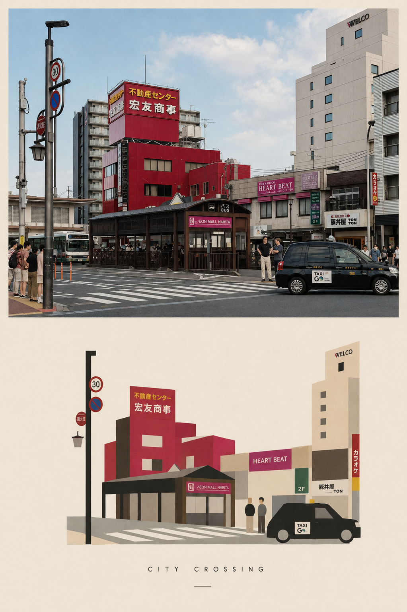
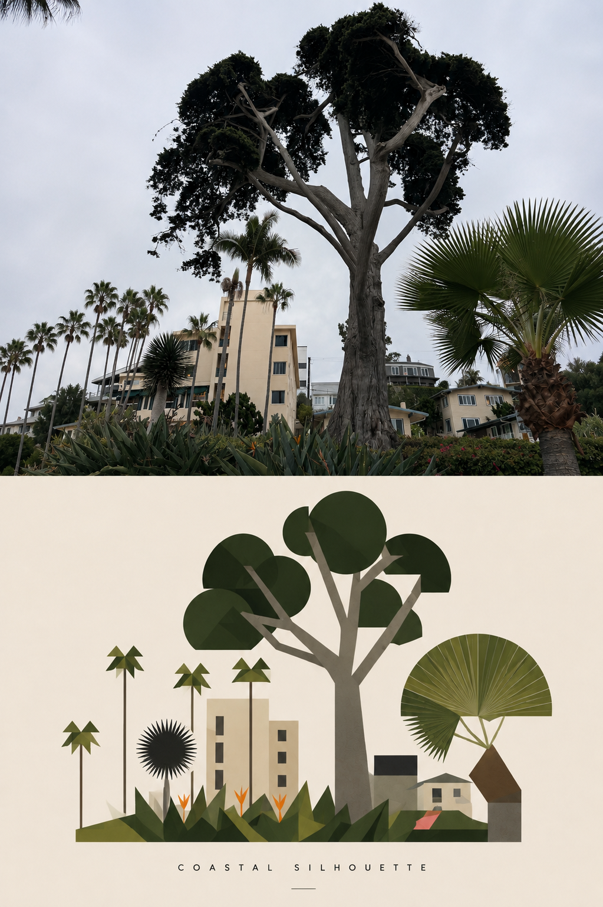
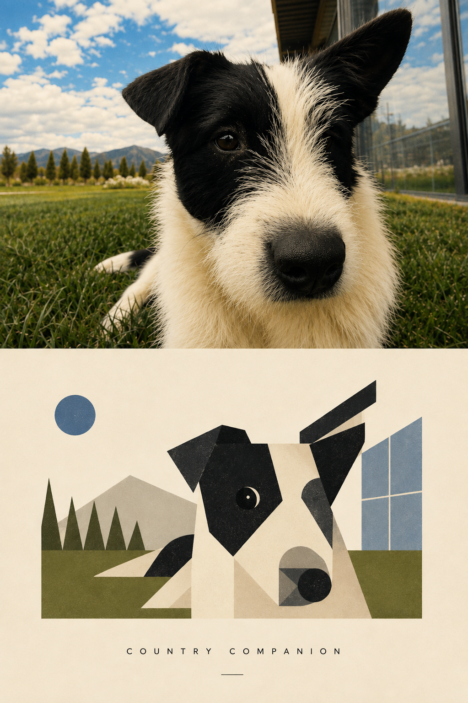
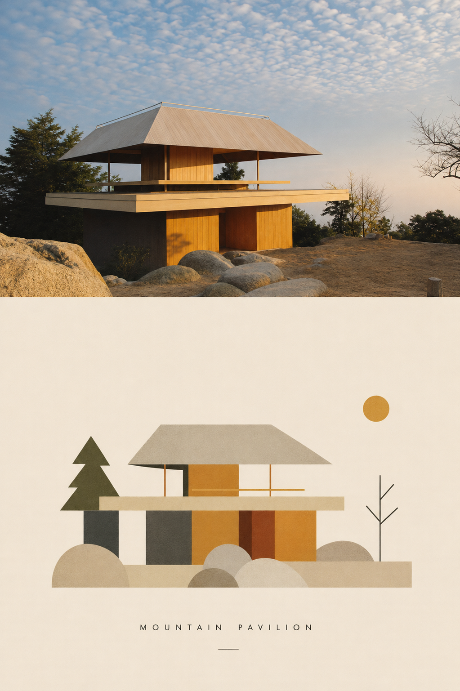
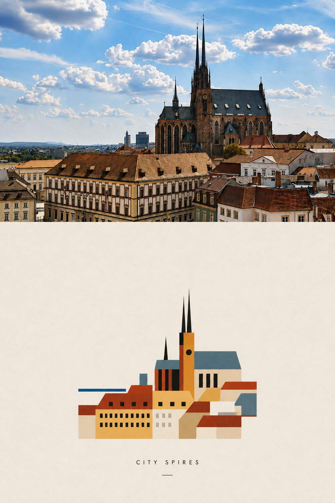

# formhaus-img

**Turn photographs into minimal Bauhaus-inspired editorial posters.**

formhaus-img is an image-transformation skill for turning an everyday photograph into a two-part visual study: the original moment on top, and a distilled geometric interpretation underneath.

Instead of tracing every detail, the skill looks for the image's essential visual grammar — its strongest silhouette, proportions, architecture, natural forms, color relationships, rhythm, and spatial structure — then rebuilds those ideas with simple geometric shapes, a limited palette, and generous negative space.

> **The photograph records the scene. The graphic interpretation reveals its structure.**

## What it does

Upload a photograph and formhaus-img will:

- keep the original photograph **full-bleed across the top with no padding**
- identify the most recognizable visual elements in the scene
- remove background clutter and unnecessary detail
- reinterpret the subject using circles, rectangles, triangles, lines, planes, and simplified silhouettes
- derive a restrained **3–5 color palette** from the source photograph
- place the illustration at roughly **70% width** within a spacious ivory lower field
- generate a short, image-specific editorial title
- combine everything into one collectible poster-like composition

The goal is not to reproduce the photograph as a vector illustration. It is to **reduce the photograph until only its most meaningful visual relationships remain**.

## Visual language

The style draws from Bauhaus-era visual communication, geometric abstraction, architectural studies, early modernist print design, and experimental European editorial graphics.

The output favors:

**Geometry over detail · Structure over decoration · Flat color over rendering · Negative space over density · Recognition through reduction**

Subtle paper and screen-print texture can be used to keep the result tactile and editorial rather than digitally sterile.

## Examples

### City Crossing
A visually dense Japanese streetscape becomes a compact system of red architectural blocks, signage, crossing lines, street furniture, and a simplified taxi.



### Coastal Silhouette
A complex landscape of trees, palms, vegetation, and residential architecture is reduced to strong organic silhouettes and layered geometric forms.



### Country Companion
A close-up dog portrait is rebuilt from bold geometric planes while preserving the asymmetrical ears, black eye patch, white muzzle, landscape, and architectural context.



### Mountain Pavilion
The pavilion's roofline and horizontal architecture become the organizing geometry, supported by simplified rocks, trees, and a restrained warm palette.



### City Spires
A detailed European cityscape is distilled into rooftops, blocks, windows, and the cathedral's defining vertical spires.



## How to use

### With the skill

Install or add this repository to a skill-capable AI agent, upload a photograph, and say:

> **Use formhaus-img to transform this image.**

You can also guide the interpretation:

> Use formhaus-img. Keep the architecture as the main subject.

> Use formhaus-img. Make the lower composition even more abstract.

> Use formhaus-img. Preserve the strongest red elements from the original photograph.

### Without installing the skill

No installation is required. Upload your photograph to an image-capable AI model and paste the complete standalone instructions from [`PROMPT.md`](PROMPT.md).

## Core rules

1. **Top photo is full bleed.** No padding, border, frame, or surrounding paper.
2. **Do not redesign the photograph.** Keep it recognizable and largely unchanged.
3. **Interpret rather than trace.** Find the visual idea behind the image.
4. **Simplify aggressively.** Remove anything that does not help recognition.
5. **Lower illustration stays compact.** Approximately 70% of the available width.
6. **Use generous negative space.** Empty space is part of the composition.
7. **Use a limited source-derived palette.** Usually 3–5 colors.
8. **Keep the title specific.** Maximum three words, based on the actual photograph.

## Repository structure

```text
formhaus-img/
├── SKILL.md
├── PROMPT.md
├── README.md
├── CHANGELOG.md
├── CONTRIBUTING.md
├── LICENSE
└── examples/
    ├── city-crossing.png
    ├── coastal-silhouette.png
    ├── country-companion.png
    ├── mountain-pavilion.png
    └── city-spires.png
```

## Design principle

A successful result should still remind you immediately of the original photograph — but it should achieve that with far fewer elements.

**Keep less. Emphasize more.**
